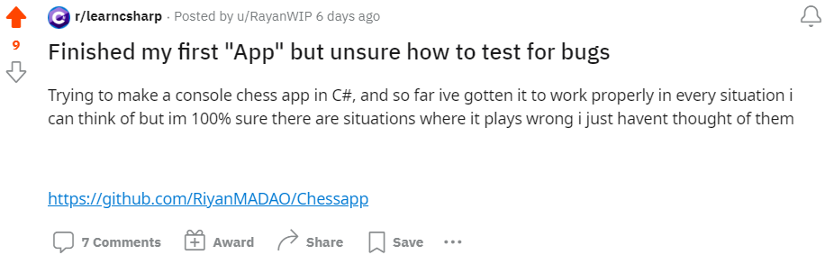
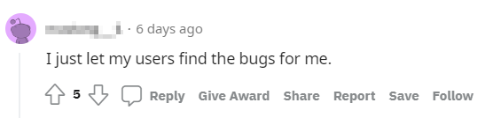
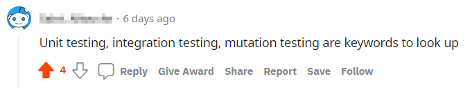
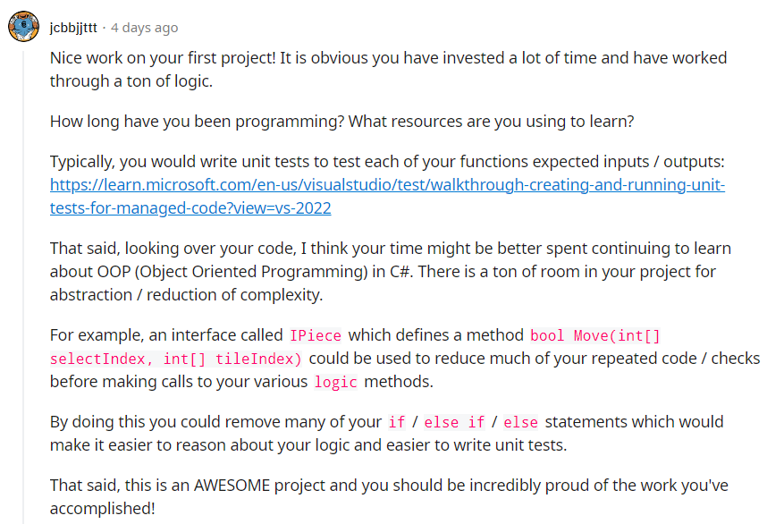
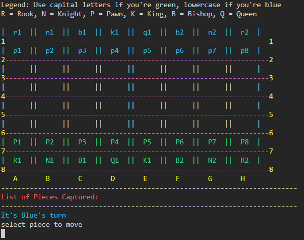
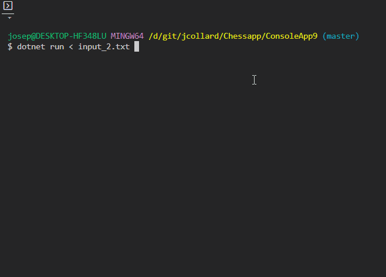

# Refactoring a Chess Program in C#

I want to take you with me on a journey in which I refactor a
Chess program that was written by a novice coder. The original source code is
spaghetti code with the majority of the functionality crammed into a single main
method. But, I really do not want to judge the original code. We have all been
there at one point or another, especially in the early stages of learning to
program.

Honestly, I have always wanted to program a Chess game but have never managed to
put in the time to do it. So, let me start by saying that I think it is amazing
that there is a person out there who decided to tackle this as a first project!

Second, a huge amount of kudos to anyone willing to post their code on the
Internet and ask for help.

And finally, a huge thanks to **u/RayanWIP** for giving me permission to dissect
their code on my live stream, create a tutorial video, and write up this
article.

So... let's get to it!

# tl;dr;

I never intended to write so many words... but here we are.

The 10 second version: I took a Chess program with a 700-ish line **Main**
method, [Link to
Original](https://github.com/jcollard/Chessapp/tree/pre-refactor), and did my
best to refactor it into code that uses an Object Oriented design: [Link to
Result](https://github.com/jcollard/Chessapp/tree/oo-refactor-part5).

I live streamed the entire refactor so I could go back and chop it into a
tutorial video (pending creation). This article goes into the details of my
experience with that refactor.

You can watch the full (unabridged) live stream
here:[LINK](https://www.youtube.com/watch?v=ZAEtUKu3Q-4&list=PLBdNYhNqW67lfpwfIJ1ne_l4cHtuAHU6g)

And now the long version...

# Table of Contents

- [Refactoring a Chess Program in C#](#refactoring-a-chess-program-in-c)
- [tl;dr;](#tldr)
- [Table of Contents](#table-of-contents)
- [The original post](#the-original-post)
- [My Response](#my-response)
- [How I got here](#how-i-got-here)
- [Overview of the Refactor](#overview-of-the-refactor)
- [Part 1: Building an Input / Output Test](#part-1-building-an-input--output-test)
  - [The Plan](#the-plan)
  - [Creating Input Tests](#creating-input-tests)
  - [Replaying the Game](#replaying-the-game)
  - [Problems Creating Output Files](#problems-creating-output-files)
- [Part 2: Extracting Local Functions](#part-2-extracting-local-functions)
- [Part 3: Moving to an Object Oriented Design](#part-3-moving-to-an-object-oriented-design)
  - [The IPiece Interface](#the-ipiece-interface)
  - [The AbstractPiece Class](#the-abstractpiece-class)
  - [Refactoring Logic Checks](#refactoring-logic-checks)
  - [Refactoring SubLogic for each Piece](#refactoring-sublogic-for-each-piece)
    - [King](#king)
    - [Knight](#knight)
    - [Rook, Bishop, and Queen](#rook-bishop-and-queen)
    - [Pawn](#pawn)
- [Part 4: Removing Global Variables](#part-4-removing-global-variables)
- [Last Thoughts / What's next?](#last-thoughts--whats-next)


# The original post

A few days ago a user by the name of **/u/RayanWIP** shared a console based
Chess program they had written on
[/r/learncsharp](https://www.reddit.com/r/learncsharp/) and asked for advice on
how they should test for bugs:



Here is a [Link to the Original
Post](https://www.reddit.com/r/learncsharp/comments/yvk2xe/finished_my_first_app_but_unsure_how_to_test_for/)


Looking through the comments section, there were not many helpful comments. 

Two stood out to me:

The first gave me a chuckle:



Then... it sunk in a little bit that this feels too true for many projects.
Unfortunately, I don't think this comment is particularly helpful when your user
base is essentially 1 (yourself).

The second recommended doing some research into software testing terms:



Although short, this response felt reasonable and to the point. When I first saw
the post, I planned to write something similar. 

Anyone who knows me, knows that I typically require my students to use and write
unit tests on all of their projects (much to their disdain). 

Since another user had already suggested this, I thought it might be nice to
look over the source code and point out a project specific example of how they
might specifically go about unit testing it.

# My Response

Looking through the source code, it quickly became apparent that this code base
was not in a state that could be unit tested.

The main challenge was that the source code was split between two classes:

**PrintBoard** - Which contained logic for displaying the state of the chess
board to the console.

and...

**Program** - Which contained a single **Main** method which contained
everything else (No judgement, we've all done it at some point). 

Without any "units" there are no "unit tests".

That said, the **Main** method did contain several locally defined function that
I was hopeful could be pulled out and those methods might be testable.

However, at this point, I felt that it might be more productive for
**/u/RayanWIP** to focus their study on developing their Object Oriented skills
rather than specifically digging into testing code.

With that in mind, I wrote my response:



# How I got here

It was inspiring to see a young programmer attempting to write a Chess program.
There was a ton of good stuff happening in the code from a purely logical stand
point. You could actually run the program and play a game of "hot-seat" Chess
with another person.

Here is the screen that comes up when you start the program:



With that in mind, I thought this could be a good opportunity to demonstrate how
I might approach refactoring a messy code base. So, with **u/RayanWIP**'s
permission, I live recorded and streamed myself working through the process in
the hopes that I might be able to edit down to a homework video for my students
to watch.

Although I do not recommend it, if you would like to watch me sweat my way
through the entire 12 hours of refactoring, you can do so here: [YouTube
Link](https://www.youtube.com/watch?v=ZAEtUKu3Q-4&list=PLBdNYhNqW67lfpwfIJ1ne_l4cHtuAHU6g)

# Overview of the Refactor

The refactor consisted of 4 major parts, each of which had several smaller
steps. I will start with a high level overview of each part here and then go
into details in the subsequent sections.

1. Typically, one of the main goals of refactoring is to rewrite a program to be
   more manageable **WITHOUT** modifying the behavior. With this in mind, the
   first thing I created was an input / output test so I could give myself
   confidence that any modifications I made didn't break the existing program.

2. With a basic input / output test, I extracted all of the locally defined
   functions as static methods in an attempt to manage the complexity within the
   **Main** method as well as define a simplified "Game Loop".

3. With a somewhat manageable set of static methods, I moved on to removing
   repeated code by refactoring existing methods into a class hierarchy. This
   resulted in 3 main ideas: `GameState`, `IPiece`, and `AbstractPiece`. As well
   as 6 relatively concise subclasses: `PawnPiece`, `RookPiece`, `KnightPiece`,
   `BishopPiece`, `QueenPiece`, and `KingPiece.

4. In the step 2, I begrudgingly introduced a handful of public global variables
   which I had been dying to remove. With a solid OO design in place, I was
   finally able to delete the remaining global state and add it "nicely" into
   the `GameState` class.

# Part 1: Building an Input / Output Test

Typically, one of the main goals of refactoring is to rewrite a program to be
more manageable **WITHOUT** modifying the behavior. With this in mind, the first
thing I created was an input / output test so I could give myself confidence
that any modifications I made didn't break the existing program.

## The Plan

Because the program accepts inputs from the keyboard and outputs text to the
terminal, I thought it would be easy to "record" my inputs by writing them to a text file (`input.txt`) and
store the programs output in another text file (`output.txt`).

With these two files, I would then be able to feed a modified version of the program
the "recorded" `input.txt` file and verify that the newly produced output it matches the
original `output.txt`.

Simple enough, right?

## Creating Input Tests

To start out, I wrote a simple static `Utils` class that contained a
`ReadLine()` method that would "record" inputs. Then, I would replace all calls
to `Console.ReadLine()` with my `Utils.ReadLine()` method. Here is the method I
came up with:

```csharp
public static string ReadLine()
{
    string input = Console.ReadLine()!;
    StreamWriter outputFile = File.AppendText("temp_inputs.txt");
    outputFile.WriteLine(input);
    outputFile.Close();
    return input;
}
```

I then manually played through a very long and very bad chess game in which I
moved every piece at least once, tested bad inputs, and tried to find edge cases
that were not implemented. This is an incredibly boring portion of the live
stream that no one should ever endure.

## Replaying the Game

After completing the game, I moved the `temp_inputs.txt` file containing all of
the inputs to a file called `input_2.txt` (Yeah, I foolishly created an `input_1.txt` file by hand before writing my `Utils.ReadLine()` method).

I then piped `input_2.txt` as input to the program:

```
$ dotnet run < input_2.txt
```

It's a little hard to see in the GIF below BUT this is the game playing itself
as fast as my console can print it to the screen.



Woo-hoo! It worked! I now had a way to replay a previously recorded games.

## Problems Creating Output Files

Next, I tried to create an output file using the original code so I would have a
"baseline" to compare all changes with. To do this, I ran the following command,
which "pipes" all of the output to a file called `output_2.txt`

```
$dotnet run < input_2.txt >> output_2.txt
```

Unfortunately, this resulted in several exceptions related to unsupported
console methods. In this case `Console.Clear()` and
`Console.SetCursorPosition()`.

I attempted to solve this by adding a few more methods to the `Utils` class:

```csharp
public static void TryClear()
{
    try
    {
        Console.Clear();
    }
    catch
    {
        Console.WriteLine("\nCLEAR()\n");
    }
}

public static void SetCursorPosition(int left, int top)
{
    try
    {
        Console.SetCursorPosition(left, top);
    }
    catch
    {
        Console.WriteLine($"\nSetCursorPosition({left},{top})\n");
    }
}
```

At first, this seemed like it was going to work. Running the program
and piping the output to `output_2.txt` did not result in any exceptions.

However, simply running the command twice would sometimes result in differing
files. The changes were mostly insignificant... extra
whitespace / the order the cursor position was being set would be different. But
this was enough that I knew this wouldn't be reliable.

I'm embarrassed to say that I wasn't able to fix this issue and eventually gave up
on the idea of comparing the original output with the modified output.

Instead, I decided I would have to watch the game play out in the terminal after 
each change and do my best to "eye-ball" the differences. I wasn't happy with this but
at least it was **SOMETHING** that would provide me with a small amount of confidence
after each change.

With that said, I am very happy I had this simple test as it did save me from
myself against several failed refactors. Without it, I almost certainly would
have spent hours trying to debug weird edge cases.

# Part 2: Extracting Local Functions

With the basic test available, the next step was to try and pull as much code as I
could manage out of the 700-ish line **Main** method.

While doing this, my goal was to identify duplicate code as well as spots for
abstraction and simplification.

Starting at the top of the **Main** method I worked my way down. Each time I
encountered a locally defined function, I would attempt to extract it as a static method.

For example:

```csharp

static void Main(string[] args)
{

    /// ... Code omitted for brevity

    PrintBoard changes = new PrintBoard();

    int[] indexselect(string select)
    {
        int[] array = new int[2];
        for (int i = 0; i <= 7; i++)
        {
            for (int j = 0; j <= 7; j++)
            {
                if (changes.BoardLayout[i, j] == select) 
                { 
                    array[0] = i; array[1] = j; 
                }
            }
        }
        return array;
    }

    /// ... Code omitted for brevity
}
```

Was extracted to:

```csharp
private static PrintBoard changes = new PrintBoard();

private static int[] indexselect(string select)
{
    int[] array = new int[2];
    for (int i = 0; i <= 7; i++)
    {
        for (int j = 0; j <= 7; j++)
        {
            if (changes.BoardLayout[i, j] == select) 
            { 
                array[0] = i; array[1] = j; 
            }
        }
    }
    return array;
}

static void Main(string[] args)
{

    /// ... Code omitted for brevity

}
```

With each extraction, I would run my simple input / output test to
verify the program was continuing to produce the same output.

The majority of the locally defined functions could be easily extracted via a
cut, paste, and adding the `static` keyword in front of it. 

In a few instances, there were local variables that were being used across
multiple functions. This forced me to also extract them as `static` variables,
which made me feel a bit dirty. But, I kept in the back of my mind that this was
temporary and I would eventually remove them.

Here were the methods and variables that were straight forward to extract:

```csharp
// Variables
private static int DELAY = 0;
private static PrintBoard changes = new PrintBoard();
private static PrintBoard movecheck = new PrintBoard();
private static string[,] BoardLayout = new string[8, 8];
private static List<string> AddressList = new List<string>();
private static string[] Rows = { "1", "2", "3", "4", "5", "6", "7", "8" };
private static string[] Columns = { "A", "B", "C", "D", "E", "F", "G", "H" };

// Methods
static void ClearCurrentConsoleLine();
static int[] indexselect(string select);
static int[] indextile(string tile);
static void fillboardaddresses();
static void kingmoves(int[] selectindex);
static bool kinglogic(int[] selectindex, int[] tileindex);
static void pawnmoves(int[] selectindex);
static bool pawnlogic(int[] selectindex, int[] tileindex);
static void bishopmoves(int[] selectindex);
static bool bishoplogic(int[] selectindex, int[] tileindex);
static void rookmoves(int[] selectindex);
static bool rooklogic(int[] selectindex, int[] tileindex); 
static void queenmoves(int[] selectindex);
static bool queenlogic(int[] selectindex, int[] tileindex);
```

Unfortunately, at this point the main method was still quite long (200-ish
lines) mostly due to a local function `tileselect()` which handled the logic for
selecting the piece to move, displaying possible moves, selecting the position
to move to, moving the piece, and checking if the game was finished.

Extracting this method directly would require me to make several variables
global. I really was torn and ultimately decided to refactor this method into
4 smaller methods: `IsGameOver`, `PieceSelect`, `tileselect` and `MovePiece`.

Here are the signatures of the methods I added / modified:

```csharp
/// Checks if the game has ended and returns true if it has.
static bool IsGameOver();

/// Prompts the user to select a piece to move. 
/// Returns the selected piece and the row / col of that piece.
static (string, int[] address) PieceSelect();

/// Given a selected piece and starting location of that piece.
/// Prompts the user to select a tile to move to.
static string tileselect(ref string select, ref int[] address);

/// Updates the board by putting a blank on the selected pieces location
/// and placing it in the tile. If a piece was in the tile, it is added to the deadpieces
/// list (captured).
private static void MovePiece(string select, string tile)
```

I was not happy about was the use of the two reference parameters for the
`tileselect` method. In my opinion, this was almost as bad as just making those variables
global... maybe worse. 

However, I was stubborn, didn't want to make them global, and was tired of my test
failing. So, I gave in and made this concession to make it a little easier to get
input / output test passing. I made a note of how much I hated what I had done here
and I promised myself I would come back to clean it up later.

With these new changes, I was finally able to refactor the **Main** method to
contain a relatively simple game loop:

```csharp
static void Main(string[] args)
{
    movecheck.initialize();
    changes.initialize();
    changes.Print();
    fillboardaddresses();
    while (!IsGameOver())
    {
        Console.WriteLine();
        string select = "";
        int[] address = indexselect(select);

        (select, address) = PieceSelect();
        string tile = tileselect(ref select, ref address);

        Utils.TryClear();
        changes.Print();
        MovePiece(select, tile);

        changes.turn++;
        Utils.TryClear();
        changes.Print();
    }
}
```

# Part 3: Moving to an Object Oriented Design

With all of the methods extracted, I was ready to start thinking about how I
could leverage an Object Oriented design to remove repeated code and manage the
complexity of the program.

You may have noticed in the previous section there were several methods that had
near identical signatures:

```csharp
// These methods calculate and display the possible moves a piece can make given they are in the selected position.
static void kingmoves(int[] selectindex);
static void pawnmoves(int[] selectindex);
static void bishopmoves(int[] selectindex);
static void rookmoves(int[] selectindex);
static void queenmoves(int[] selectindex);

// These methods return true if a piece of the given type can move from
// selectindex to tileindex
static bool kinglogic(int[] selectindex, int[] tileindex);
static bool pawnlogic(int[] selectindex, int[] tileindex);
static bool bishoplogic(int[] selectindex, int[] tileindex);
static bool rooklogic(int[] selectindex, int[] tileindex); 
static bool queenlogic(int[] selectindex, int[] tileindex);
```

These methods were used in a few places throughout the code typically as part of a
large branching set of `if` / `else if` / `else` statements. 

For example, after
the player selects a piece to move and the possible locations that piece can move
are highlighted on the screen.

The section of code that does this can be seen below:

```csharp
static string tileselect(ref string select, ref int[] address)
{
    while (true)
    {
        if (select.Contains('p') || select.Contains('P'))
        {
            pawnmoves(address);
        }
        if (select.Contains('q') || select.Contains('Q'))
        {
            queenmoves(address);
        }
        if (select.Contains('n') || select.Contains('N')) { //... }
        if (select.Contains('B') || select.Contains('b')) { //... }
        if (select.Contains('r') || select.Contains('R')) { //... }
        if (select.Contains('K') || select.Contains('k')) { //... }

        // omitted for brevity
    }
}
```

When you see code like this, it is an indicator that you could be using
inheritance and polymorphism to manage the complexity of selecting which method
to perform. 

As soon as I saw this chunk of code, I knew that I would eventually want to
refactor it to something like this:

```csharp
IPiece piece = GetPiece(address);
piece.ShowMoves();
```

## The IPiece Interface

To do this, I first needed to define the interface `IPiece`. I knew I would
need a method for `Logic` and `GetMoves` but, thinking a bit ahead, I also
decided it would be useful to define a few additional properties. 

Here is the initial interface I came up with:

```csharp
public interface IPiece 
{
    /// Given a position on the board, returns a list of possible moves
    /// that can be made by this IPiece.
    public List<(int, int)> GetMoves((int row, int col) pos);

    /// Given a starting position and a target position, returns true if the
    /// piece selected can perform such a move and false otherwise.
    public bool Logic((int row, int col) startPos, (int row, int col) targetPos);

    /// The 2 character string representing this IPiece on the board
    public string Symbol { get; }

    /// The color of this IPiece
    public PieceColor Color { get; }

    /// The position of this IPiece on the board.
    public (int, int) Position { get; }
}
```

With the interface defined, I took a crack at creating a `PawnPiece` which
implemented the `IPiece` interface. 

The constructor for `PawnPiece` allowed me to specify the symbol, color, and position properties.

Next, I copied the code from `pawnmoves` and `pawnlogic` into `PawnPiece.GetMoves` and `PawnPiece.Logic`
and applied a few tweaks to make the compiler happy with my altered method signature:

```csharp
// Full source here: https://github.com/jcollard/Chessapp/blob/e298305bdefc7fd144dc1775b98c5f6a72b1f8ba/ConsoleApp9/Piece/PawnPiece.cs
public class PawnPiece : IPiece
{
    
    // properties omitted for brevity

    public PawnPiece(string symbol, PieceColor color, (int, int) position)
    {
        // initialize the properties
    }

    public List<(int, int)> GetMoves((int row, int col) pos)
    {
        // copy / pasted from `pawnmoves`
    }

    public bool Logic((int row, int col) start, (int row, int col) target)
    {
        // copy / pasted from `pawnlogic`
    }
}
```

Unfortunately, the `pawnmoves` and `pawnlogic` methods relied on a few of the
static variables from the Main class. This resulted in making them public global
variables to appease the compiler.

Making note that I would eventually need to eliminate these global variables, I 
created a `GameState` class that would eventually serve as a non-static replacement.

For now, it simply instantiated 16 pawns (8 for each side of the board) and 
provided access to them via a `GetPiece` method. For quick lookup, I utilized
C#'s `Dictionary` class to map each pieces string symbol (e.g. "p1", "P3", "p5", etc...)
to the piece itself.

Here is the GameState class at this point in the refactor:
```csharp
public class GameState
{
    
    private readonly Dictionary<string, IPiece> pieces = new ();

    public GameState()
    {
        for (int i = 1; i <= 8; i++)
        {
            pieces["p" + i] = new PawnPiece("p" + i, PieceColor.Blue, (1, i-1));
            pieces["P" + i] = new PawnPiece("P" + i, PieceColor.Green, (6, i-1));
        }
    }

    /// Given a symbol representing a piece, return an IPiece 
    /// if it exists and null otherwise.
    public IPiece? GetPiece(string symbol)
    {
        if (pieces.TryGetValue(symbol, out IPiece? value))
        {
            return value;
        }
        return null;
    }
}
```

Finally, it was time to refactor any code that used `pawnlogic` or `pawnmoves`
and delete those methods. The code segment that displayed possible moves became:

```csharp
IPiece? piece = gameState.GetPiece(select);
if (piece == null)
{
    if (select.Contains('q') || select.Contains('Q')) { // ... }
    if (select.Contains('n') || select.Contains('N')) { // ... }
    if (select.Contains('B') || select.Contains('b')) { // ... }
    if (select.Contains('r') || select.Contains('R')) { // ... }
    if (select.Contains('K') || select.Contains('k')) { // ... }
}
else
{
    piece.GetMoves((address[0], address[1]));
}
```

Again, with each change I ran the input / output test I created to give myself
some confidence that I had not completely broken the program. And in several
instances, I **DID** break something. Having this quick feedback allowed me to
undo what I had just changed and try again.

## The AbstractPiece Class

Initially, I simply created an `IPiece` interface and wrote a single subclass
`PawnPiece`. However, very early on, it became clear that there was a ton of
duplicate code in the `moves` and `logic` methods. Here are two of the `move`
methods from the original program:


```csharp
static void kingmoves(int[] selectindex)
{
    foreach (string i in BoardLayout)
    {
        int[] arr = indextile(i);
        if (kinglogic(selectindex, arr))
        {
            movecheck.BoardLayout[arr[0], arr[1]] = "XX";
        }
        else
        {
            movecheck.BoardLayout[arr[0], arr[1]] = changes.BoardLayout[arr[0], arr[1]];
        }
    }
    Utils.TryClear();
    movecheck.Print();
    Thread.Sleep(DELAY);
    Utils.TryClear();
    changes.Print();
}

static void bishopmoves(int[] selectindex)
{
    foreach (string i in BoardLayout)
    {
        int[] arr = indextile(i);
        if (bishoplogic(selectindex, arr))
        {
            movecheck.BoardLayout[arr[0], arr[1]] = "XX";
        }
        else
        {
            movecheck.BoardLayout[arr[0], arr[1]] = changes.BoardLayout[arr[0], arr[1]];
        }
    }
    Utils.TryClear();
    movecheck.Print();
    Thread.Sleep(DELAY);
    Utils.TryClear();
    changes.Print();
}
```

Notice any similarities? With the exception of the names and a call to the
associated `logic` method, they are identical. This means that we should do our best
to reuse this code.  

To do this, I wrote an `AbstractPiece` class which implements `IPiece` and has a single `GetMoves` method.

Here is the first version of the `AbstractPiece` class I wrote:

```csharp
// full source here: https://github.com/jcollard/Chessapp/blob/d88aaaea97829c081eb54e6413df83259757feb2/ConsoleApp9/Piece/AbstractPiece.cs
public abstract class AbstractPiece : IPiece
{

    // properties omitted for brevity

    public AbstractPiece(string symbol, PieceColor color, (int, int) position)
    {
        this._symbol = symbol;
        this._color = color;
        this._position = position;
    }

    public List<(int, int)> GetMoves((int row, int col) pos)
    {
        List<(int, int)> moves = new ();
        foreach (string i in Program.BoardLayout)
        {
            int[] arr = Program.indextile(i);
            (int row, int col) target = (arr[0], arr[1]);
            if (this.Logic(pos, target))
            {
                Program.movecheck.BoardLayout[target.row, target.col] = "XX";
                moves.Add(target);
            }
            else
            {
                Program.movecheck.BoardLayout[target.row, target.col] = Program.changes.BoardLayout[target.row, target.col];
            }
        }
        Utils.TryClear();
        Program.movecheck.Print();
        Thread.Sleep(Program.DELAY);
        Utils.TryClear();
        Program.changes.Print();
        return moves;
    }
    
    public abstract bool Logic((int row, int col) startPos, (int row, int col) targetPos);
}
```

Next, I refactored `PawnPiece` to extend `AbstractPiece`:

```csharp
// full source here: https://github.com/jcollard/Chessapp/blob/d88aaaea97829c081eb54e6413df83259757feb2/ConsoleApp9/Piece/PawnPiece.cs
public class PawnPiece : AbstractPiece
{
    
    public PawnPiece(string symbol, PieceColor color, (int, int) position) : base(symbol, color, position) { }

    public override bool Logic((int row, int col) start, (int row, int col) target)
    {
        // omitted for brevity
    }
}
```

With this change, each subclass of `AbstractPiece` only needs to implement an appropriate `Logic` method.

With this in place, I create a class for each of the remaining 5 pieces, added
the appropriate instances to `GameState`.

Here is the updated `GameState`:

```csharp
// full source: https://github.com/jcollard/Chessapp/blob/b8acba73960a5798c55af48d017e32a985e88d5e/ConsoleApp9/GameState.cs
public class GameState
{
    
    private readonly Dictionary<string, IPiece> pieces = new ();

    public GameState()
    {
        for (int i = 1; i <= 8; i++)
        {
            pieces["p" + i] = new PawnPiece("p" + i, PieceColor.Blue, (1, i-1));
            pieces["P" + i] = new PawnPiece("P" + i, PieceColor.Green, (6, i-1));
        }
        pieces["k1"] = new KingPiece("k1", PieceColor.Blue, (0, 3));
        pieces["K1"] = new KingPiece("K1", PieceColor.Green, (7, 4));
        pieces["q1"] = new QueenPiece("q1", PieceColor.Blue, (0, 4));
        pieces["Q1"] = new QueenPiece("Q1", PieceColor.Green, (7, 3));

        pieces["n1"] = new KnightPiece("n1", PieceColor.Blue, (0, 1));
        pieces["N1"] = new KnightPiece("N1", PieceColor.Green, (7, 1));
        pieces["n2"] = new KnightPiece("n2", PieceColor.Blue, (0, 6));
        pieces["N2"] = new KnightPiece("N2", PieceColor.Green, (7, 6));

        pieces["b1"] = new BishopPiece("b1", PieceColor.Blue, (0, 2));
        pieces["B1"] = new BishopPiece("B1", PieceColor.Green, (7, 2));
        pieces["b2"] = new BishopPiece("b2", PieceColor.Blue, (0, 5));
        pieces["B2"] = new BishopPiece("B2", PieceColor.Green, (7, 5));

        pieces["r1"] = new RookPiece("r1", PieceColor.Blue, (0, 0));
        pieces["R1"] = new RookPiece("R1", PieceColor.Green, (7, 0));
        pieces["r2"] = new RookPiece("r2", PieceColor.Blue, (0, 7));
        pieces["R2"] = new RookPiece("R2", PieceColor.Green, (7, 7));
    }

    public IPiece GetPiece(string symbol)
    {
        if (pieces.TryGetValue(symbol, out IPiece? value))
        {
            return value;
        }
        throw new ArgumentException($"The symbol {symbol} is not a valid piece on this board.");
    }
}
```

One thing to note in the code above is that `GetPiece` no longer returns a **nullable**
`IPiece`. With all of the pieces now in the `GameState`, I decided it was appropriate to 
throw an exception if an invalid symbol was passed to `GetPiece`.

The resulting code for showing the possible moves a piece can make was now
reduced to two lines and 0 if statements:

```csharp
IPiece piece = gameState.GetPiece(select);
piece.GetMoves((address[0], address[1]));
```

Not bad!

Additionally, I was able to delete all of the `moves` and `logic` methods from the **Main** class.

## Refactoring Logic Checks

While copying each of the `logic` methods into the appropriate subclass of
`AbstractPiece`, I noticed that all of them started with the exact same check:

```csharp
public override bool Logic((int row, int col) start, (int row, int col) target)
{
    if (Program.changes.BoardLayout[target.row, target.col] == Program.changes.BoardLayout[target.row, target.col].ToUpper() && 
        Program.changes.BoardLayout[start.row, start.col] == Program.changes.BoardLayout[start.row, start.col].ToUpper() && 
        !Program.changes.BoardLayout[target.row, target.col].Contains(' '))
    {
        return false;
    }
    if (Program.changes.BoardLayout[target.row, target.col] == Program.changes.BoardLayout[target.row, target.col].ToLower() && 
        Program.changes.BoardLayout[start.row, start.col] == Program.changes.BoardLayout[start.row, start.col].ToLower() && 
        !Program.changes.BoardLayout[target.row, target.col].Contains(' '))
    {
        return false;
    }

    /// differing code follows ...
}
```

After spending some time thinking through this logic, it turns out that this
check is ensuring that a piece cannot move into spaces occupied by pieces of the
same color.

To help manage this, I added two helper methods. 

* `GameState.IsEmpty` which checks if a space is not occupied
* `IPiece.IsEnemy` which checks if a piece is an enemy piece

This allowed me to refactor the code above to:

```csharp
public bool Logic((int, int) start, (int, int) target, GameState gameState)
{
    if(!gameState.IsEmpty(target) && !this.IsEnemyPiece(target, gameState))
    {
        return false;
    }

    /// differing code follows ...
}


```

Notice that I did have to alter the signature of `Logic` to accept a `GameState`
object. But, I felt this was okay as it made the code much more readable.
Additionally, the logic for `IsEmpty` and `IsEnemyPiece` were relatively simple:

```csharp
// In GameState
public bool IsEmpty((int row, int col) pos)
{
    string targetSymbol = Program.changes.BoardLayout[pos.row, pos.col];
    return targetSymbol.Contains(' ');
}

// In AbstractPiece
protected bool IsEnemyPiece(IPiece other) => other.Color != this.Color;

// This method uses global state to extract the piece at a given position
// by finding its string symbol on the board. 
protected bool IsEnemyPiece((int row, int col) target, GameState gameState)
{
    string targetSymbol = Program.changes.BoardLayout[target.row, target.col];
    return gameState.TryGetPiece(targetSymbol, out IPiece? other) && this.IsEnemyPiece(other);
}
```

With this change in place, I still had the generic check at the start of each
`Logic` method. So, I decided to move this check into `AbstractPiece.Logic` and 
and provide an abstract `SubLogic` method that each sub class would implement. The idea here
is that all common checks should go in `AbstractPiece.Logic` and any piece-specific checks should be
implemented in the subclasses `SubLogic` method. 

Here is the final `AbstractPiece.Logic` method:

```csharp
// Full source here: https://github.com/jcollard/Chessapp/blob/master/ConsoleApp9/Piece/AbstractPiece.cs

public bool Logic((int row, int col) target)
{
    // Pieces cannot move onto themselves
    if (this.Position == target)
    {
        return false;
    }
    // Cannot capture pieces of the same color
    if (!this._gameState.IsEmpty(target) && 
        !this.IsEnemyPiece(this._gameState.GetPiece(target)!))
    {
        return false;
    }
    return SubLogic(target);
}

/// Given a target position, checks the piece specific logic for moving this 
/// piece to that position on the board. If the piece can move there,
/// returns true and otherwise returns false.
protected abstract bool SubLogic((int row, int col) targetPos);
```

An important thing to note here is that `SubLogic` is not defined in `IPiece`
and is a `protected` method which allows it to be used by subclasses.

## Refactoring SubLogic for each Piece

Looking at each pieces sub logic was a challenge for me. I had to really think
hard and try to reason through what each branch of logic was doing. It was
quite painful and I felt it best to simplify the logic in each subclass. Below is how I refactored each piece:

### King

The King can move into any adjacent space both orthogonally and diagonally. In
the original program **u/RayanWIP** did not allow for castling and did not
prevent the player from moving into check so I didn't add these in.

```csharp
/// Original:
protected override bool SubLogic((int row, int col) start, (int row, int col) target)
{
    if (Math.Abs(start.row - target.row) != 1 && 
        Math.Abs(start.col - target.col) != 1)
    {
        return false;
    }
    else if (Math.Abs(start.row - target.row) != 1 && 
             Math.Abs(start.row - target.row) != 0)
    {
        return false;
    }
    else if (Math.Abs(start.col - target.col) != 0 && 
             Math.Abs(start.col - target.col) != 1)
    {
        return false;
    }
    else
    {
        return true;
    }
}
```

Because I made `Abstract.Logic` ensure that a piece cannot move into the space
it is occupying, I was able to refactor `SubLogic` to calculate the distance
moved on the row and column and simply check that both were at most 1.

```csharp
// Refactored
protected override bool SubLogic((int row, int col) start, (int row, int col) target)
{
        int rowDist = Math.Abs(start.row - target.row);
        int colDist = Math.Abs(start.col - target.col);
        return rowDist <= 1 && colDist <= 1;
}

```

### Knight

The knight moves in an "L" shape on the board and can "hop" over pieces. This
means that it must move 2 spaces in one direction and 1 space in the other (a
total of 3 spaces).

```csharp
/// Original logic
protected override bool SubLogic((int row, int col) start, (int row, int col) target)
{
    char player = Program.changes.BoardLayout[start.row, start.col][0];

    if (Math.Abs(start.row - target.row) == Math.Abs(start.col - target.col))
    {
        return false;
    }
    if (Math.Abs(start.row - target.row) != 1 && Math.Abs(start.col - target.col) != 1)
    {
        return false;
    }
    if (Math.Abs(start.col - target.col) != 2 && Math.Abs(start.row - target.row) != 2)
    {
        return false;
    }

    return true;
}
```

Similar to the King logic, I calculate the rows and columns moved. Then, use the
knowledge that one of those values must be 1 and the sum of them must be 2 to
eliminate the if statements:

```csharp
/// Refactored logic
protected override bool SubLogic((int row, int col) start, (int row, int col) target)
{
    int rowDist = Math.Abs(start.row - target.row);
    int colDist = Math.Abs(start.col - target.col);
    return (rowDist == 1 || colDist == 1) &&
            rowDist + colDist == 3;
}
```

### Rook, Bishop, and Queen

The Rook, Bishop, and Queen shared some amount of logic so I've lumped them together here. 

More specifically, these pieces can move many spaces on the board orthogonally
or diagonally as long as they don't "jump" over another piece.  To help with
this, I wrote a helper method `IsPathClear` which takes in two positions and
checks if the path between them is empty.

Additionally, I wrote two more helpers `IsDiagonal` and `IsOrthogonal` which
determine if two positions are diagonal or orthogonal to each other.

This allowed for each of the `SubLogic` methods to be drastically simplified:

```csharp
/// RookPiece
protected override bool SubLogic((int row, int col) target)
{
    if (!Utils.IsOrthogonal(this.Position, target))
    {
        return false;
    }
    return this._gameState.IsPathClear(this.Position, target);
}
```

```csharp
/// BishopPiece
protected override bool SubLogic((int row, int col) target)
{
    if (!Utils.IsDiagonal(this.Position, target))
    {
        return false;
    }
    return this._gameState.IsPathClear(this.Position, target);
}
```

```csharp
/// QueenPiece
protected override bool SubLogic((int row, int col) target)
{
    if (!Utils.IsDiagonal(start, target) && !Utils.IsOrthogonal(start, target))
    {
        return false;
    }
    return this._gameState.IsPathClear(this.Position, target);
}
```

### Pawn

The pawn is probably the most complex piece in the game as it has several conditional rules for movement:

1. Typically, it can only move forward one space. BUT it cannot attack forward. 
2. If a piece is occupying a space diagonally in front of it, it can capture it
   and move diagonally. 
3. Also, for its first move, it may move 2 spaces forward. However, when it does
   this it cannot "hop" over a piece and cannot capture a piece.
4. If the pawn makes it to the far end of the board, it can be promoted to a
   Rook, Bishop, Knight, or Queen
5. Also, there is a rule called "En Passant" that allows the pawn to capture
   another pawn that passed it under *SOME* circumstances: [Full Rules at
   Chess.com](https://www.chess.com/terms/en-passant)

Lucky for me, **u/RayanWIP** didn't implement 4 or 5 so I "safely" ignored
them in my refactor.

```csharp
/// Original Code
protected override bool SubLogic((int row, int col) start, (int row, int col) target)
{
    char player = Program.changes.BoardLayout[start.row, start.col][0];


    if (char.ToUpper(player) == player)
    {
        if (start.row - target.row == 2 && start.row == 6 && start.col - target.col == 0 && Program.changes.BoardLayout[target.row, target.col].Contains(' ') && Program.changes.BoardLayout[target.row + 1, target.col].Contains(' '))
        {
            return true;
        }
        if (start.row - target.row == 1 && target.col == start.col && Program.changes.BoardLayout[target.row, target.col].Contains(' '))
        {
            return true;
        }
        if (start.row - target.row == 1 && Math.Abs(start.col - target.col) == 1 && Program.changes.pieces.Contains(Program.changes.BoardLayout[target.row, target.col]))
        {
            return true;
        }
        else
        {
            return false;
        }
    }
    else
    {
        if (start.row - target.row == -2 && start.row == 1 && start.col - target.col == 0 && Program.changes.BoardLayout[target.row, target.col].Contains(' ') && Program.changes.BoardLayout[target.row - 1, target.col].Contains(' '))
        {
            return true;
        }
        if (start.row - target.row == -2 && start.row == 1 && start.col - target.col == 0 && Program.changes.BoardLayout[target.row, target.col].Contains(' ') && Program.changes.BoardLayout[target.row - 1, target.col].Contains('X'))
        {
            return true;
        }
        if (start.row - target.row == -1 && target.col == start.col && Program.changes.BoardLayout[target.row, target.col].Contains(' '))
        {
            return true;
        }
        if (start.row - target.row == -1 && Math.Abs(start.col - target.col) == 1 && Program.changes.pieces.Contains(Program.changes.BoardLayout[target.row, target.col]))
        {
            return true;
        }
        else
        {
            return false;
        }
    }
}
```

I struggled quite a bit trying to refactor this code in a way that didn't feel
difficult to read. In fact, I still feel my "simplified" version is quite
challenging to understand. Ultimately, I wrote 3 if statements with complex
conditions to determine if the pawns moves for 1, 2, and 3 above were met.

Here is my sad attempt:

```csharp
protected override bool SubLogic((int row, int col) start, (int row, int col) target)
{
    int rowInc = this.Color == PieceColor.Blue ? 1 : -1;
    int targetRow = start.row + rowInc;
    int firstTurnTargetRow = start.row + 2*rowInc;
    int[] targetCols = {start.col - 1, start.col + 1};
    bool isAttack = start.col - target.col != 0;

    // Always, pawn may move forward 1 if space is empty
    if (target.row == targetRow && 
        !isAttack && 
        this._gameState.IsEmpty(target))
    {
        return true;
    }

    // On first turn, pawn may move forward 2 spaces if empty
    if (!this.HasMoved && 
        target.row == firstTurnTargetRow && 
        !isAttack && this._gameState.IsEmpty(target) && 
        this._gameState.IsPathClear(start, target))
    {
        return true;
    }

    // Can move diagonal 1 if an enemy is in that space
    if (target.row == targetRow && 
        targetCols.Contains(target.col) && 
        !this._gameState.IsEmpty(target))
    {
        return true;
    }

    // TODO: En passant move

    return false;
}
```

Perhaps some day if I'm feeling up to it, I might try to refactor this logic
again to be more readable. But, this was the best I could do at the time.

# Part 4: Removing Global Variables

Having refactored all of the `SubLogic` methods to have no references to global
state, I really wanted to remove the global variables from the **Main** class.

This involved selecting each of the global variables and slowly eliminating all
references to them throughout the code base and replace them with a call to an
instance of `GameState`. As I did this, I added necessary methods and logic to
the `GameState` class. Below is the `GameState` API after removing all global
state.

```csharp
/// Full Source: https://github.com/jcollard/Chessapp/blob/master/ConsoleApp9/GameState.cs
public class GameState
{
    /// Constructs a GameState in a traditional chess layout.
    public GameState();

    /// Given a starting and target position that are orthogonal or diagonal to each
    /// other, returns true if no pieces are found between them and false otherwise.
    public bool IsPathClear((int row, int col) start, (int row, int col) target);

    /// Returns the piece at the specified position or null if no piece is at that
    /// position.
    public IPiece? GetPiece((int row, int col) pos);

    /// Returns true if there is no piece at the specified position and false otherwise.
    public bool IsEmpty((int row, int col) pos);

    /// Given a symbol name for a piece, checks if that piece
    /// exists in this GameState. If that piece exists, sets
    /// the value of piece and returns true. Otherwise, returns false.
    public bool TryGetPiece(string symbol, out IPiece piece);

    /// Given a symbol name for a piece, returns the associated IPiece.
    /// If no such piece is on the board, throw an ArgumentException.
    public IPiece GetPiece(string symbol);

    /// Checks if the game has ended and returns true if it has.
    public bool IsGameOver();

    /// Returns the color of the active player
    public PieceColor GetActivePlayer();

    /// Prints the underlying board to the screen.
    public void PrintBoard();

    /// Given a list of positions, displays them as possible moves
    /// on the screen.
    internal void DisplayPossibleMoves(List<(int, int)> moves);

    /// Adds the specified move to the GameState history
    internal void AddMove(IPiece piece, (int, int) target) => this.moves.Add((piece, target));

    /// Given a position on the board, sets the piece, overriding any piece that may already be there.
    internal void SetPiece((int row, int col) pos, IPiece piece);

    /// Removes a piece, if it exists, from the specified location on the board
    internal void ClearPiece((int row, int col) pos);
}
```
And finally, the **Main** class:

```csharp
/// Full source: https://github.com/jcollard/Chessapp/blob/master/ConsoleApp9/Program.cs
public class Program
{
    public const int DELAY = 1000;
    private const string Rows = "12345678";
    private const string Columns = "ABCDEFGH";
    private readonly static GameState gameState = new GameState();

    static void Main(string[] args)
    {
        while (!gameState.IsGameOver())
        {
            Utils.TryClear();
            gameState.PrintBoard();

            IPiece piece = PieceSelect();
            if (!TryTileSelect(piece, out (int, int) targetPos))
            {
                continue;
            }

            piece.Move(targetPos);
        }

        Utils.TryClear();
        gameState.PrintBoard();
        PieceColor winner = gameState.GetActivePlayer() == PieceColor.Blue ? PieceColor.Green : PieceColor.Blue;
        Console.WriteLine($"{winner} is the winner!");
    }

    /// Displays an error message to the user.
    private static void DisplayError(string message);

    /// Prompts the user to select a piece to move. Returns the selected piece and the row / col of that piece.
    private static IPiece PieceSelect();
 
    /// Prompts the user to enter a tile position. 
    /// Returns true
    private static bool TryGetTile(out (int row, int col) pos);

    /// Given a piece, prompts the user to select a tile to move to or to type
    /// "BACK". If the user types back, this method return false. Otherwise,
    /// it returns true and the target parameter is set to the users choice.
    private static bool TryTileSelect(IPiece piece, out (int row, int col) target);

    /// Given a two character string of a position on the board, return
    /// its associated row, col values.
    private static (int, int) BoardPosToIndex(string tile);
}
```

# Last Thoughts / What's next?

Well... that's it! I refactored a Chess program in C# to use a more Object
Oriented style. It was a really fun experiment and I'm hoping to rework some
version of this into a class project / practice exercise in one of my courses.

It really is a tough skill to learn and apply but you can end up with something
that is much more maintainable without the need to start over from scratch.


The main goal here was to create a program that could be unit tested and 
it should be noted here that there are MANY more methods than the original
project. However, each method is much smaller and (hopefully) easier to understand. 
These are the "units" that can now be tested.

So... I guess the next step would be to write a test suite of unit tests. But, I'll
leave that for another time.

I hope someone gets some use out of this.

Until next time!